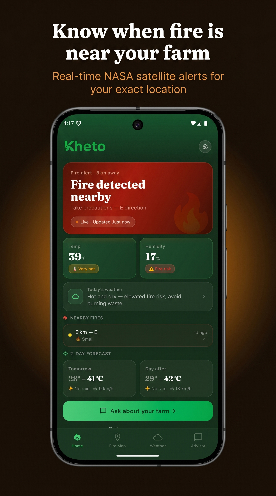
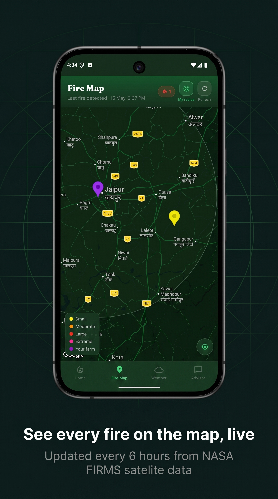
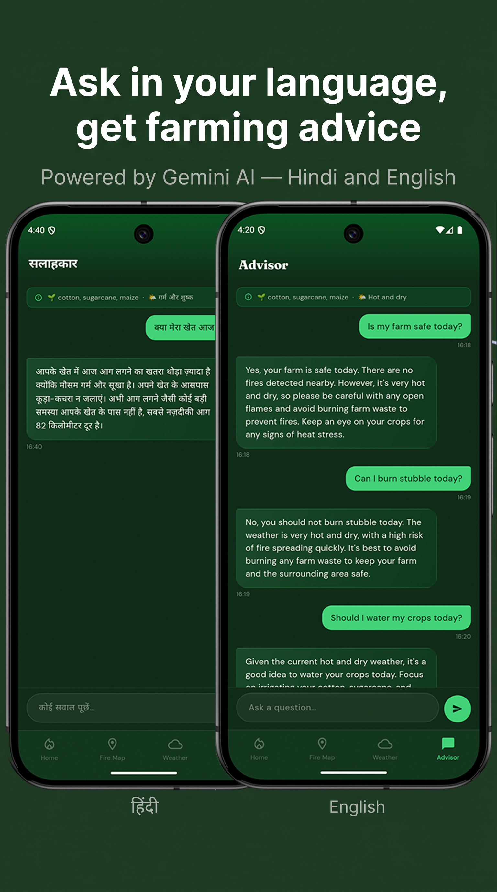
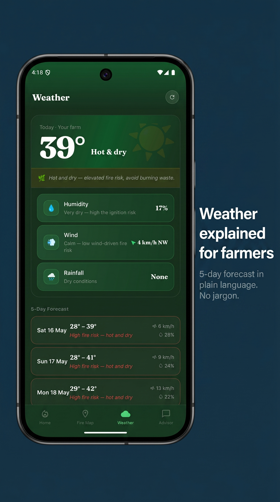

<p align="center">
  
</p>

<h1 align="center">Kheto</h1>

<p align="center">
  <strong>Live fire alerts for Indian farmers.</strong><br/>
  Real-time NASA satellite fire data, hyperlocal weather, and a bilingual AI advisor — built for smallholder farms.
</p>

<p align="center">
  
  
  
  
</p>

---

## The problem

Indian smallholder farmers get **state-level fire alerts**. A fire 80 km away in the same state triggers the same notification as one 3 km away upwind.

So farmers either panic at every alert, or — more dangerously — learn to ignore them.

Kheto fixes that. Every alert is anchored to the user's exact farm location, with distance, direction, and intensity made explicit.

---

## Who it's for

**Primary persona — Ramesh, 44, Vidarbha, Maharashtra.** Cotton + soybean, 4 acres. Android user, WhatsApp-comfortable, limited English literacy. Checks the app daily in fire season.

**Secondary — Priya, 24,** his daughter. Smartphone-confident. Installs and configures the app for the household.

> **Honest note on research:** Personas were derived from publicly available data (NDRF reports, NSSO agricultural household survey, MoSPI smartphone penetration data) and conversations with two cousins farming in Maharashtra. Not from a formal user interview cohort. Validating the personas against real beta users is one explicit goal of closed testing.

---

## Competitive landscape

| Existing tool | What it does | Where it fails Ramesh |
|---|---|---|
| Bhuvan (ISRO portal) | Pan-India fire data on a web map | Web-only, English, no notifications, no farm-level context |
| mKisan SMS service | Broadcasts agronomy advisories via SMS | Not location-specific, not fire-focused, no map |
| WhatsApp village groups | Peer warnings from cousins / neighbours | Satellite delay invisible; depends on someone else noticing first |
| Government fire-alert SMS | State-level fire warnings | The exact problem Kheto exists to fix |

Kheto's wedge is the one thing none of these do: **a notification anchored to a single farm's coordinates, with distance and direction made explicit.**

---

## What it does

| Problem | Solution | Why this approach |
|---|---|---|
| Farmers can't tell if an alert means their farm | Notifications only fire within user-configured radius (default 30 km) | 30 km is roughly the maximum wind-driven fire spread in 2–4 hours — enough buffer to protect livestock and evacuate equipment |
| State-level data hides which fire matters | Fire map with colour-coded markers by intensity (FRP), farm at the centre | Visual hierarchy makes "which one threatens me" answerable in 2 seconds |
| Weather forecasts use English meteorology jargon | Tomorrow.io data wrapped in farmer-language ("hot and dry, elevated fire risk") | Ramesh doesn't need humidity in %; he needs "should I burn stubble today" |
| Farmers want to ask follow-up questions but Hindi support in chatbots is poor | Gemini AI advisor with full farm context auto-injected, Hindi-first system prompt | Removes the cold-start ("what do I ask?") and removes the language barrier in the same step |
| Many target users are uncomfortable creating accounts | Anonymous guest path with device-UUID identity | Removes the single biggest install-funnel drop-off; trade-off: data loss on reinstall (acceptable for MVP) |

---

## Screenshots

<table>
  <tr>
    <td></td>
    <td></td>
    <td></td>
  </tr>
  <tr>
    <td align="center"><sub>Live NASA FIRMS hotspots</sub></td>
    <td align="center"><sub>Bilingual AI advisor</sub></td>
    <td align="center"><sub>Weather, no jargon</sub></td>
  </tr>
</table>

---

## Try it

Kheto is currently in **closed beta** on the Google Play Store.

📩 Email **agroshield2025@gmail.com** with the Google account you'll use on the Play Store. You'll get an opt-in link within 24 hours.

---

## Success metrics

These are the numbers Kheto's MVP is being judged against, set before launch:

| Metric | Target | Why this target |
|---|---|---|
| % testers opening app within 2h of fire notification | > 50% | Below this, the notification isn't doing its job |
| % testers opening app within 24h of fire notification | > 70% | Trust signal — users believe the alert is worth checking |
| AI advisor messages per active user per week | ≥ 1 | Indicates the advisor is solving a real question, not a novelty |
| False positive notification rate (per qualitative feedback) | < 20% | Above this, farmers learn to ignore — the same trap state-level alerts fall into |
| Real downloads + qualitative feedback responses | 10 / 5 | Minimum viable evidence to decide whether to invest in a v2 |

Metrics are wired through Firebase Analytics.

---

## Product decisions

Six decisions I made and would defend in an interview.

### 1. The fire-relevance scoring engine is built — but switched off

The engine takes raw satellite data and converts it into "this fire is/isn't a real threat to your farm." It runs silently, logs predictions to `scoringLogs/`, and surfaces nothing in the UI. Users see raw NASA FIRMS proximity instead.

**Why:** A false negative in fire safety — telling a farmer "low risk" when a fire reaches their field — destroys trust permanently. The engine needs validation against real fire events before it can become an alerting mechanism. Closed beta is where that validation dataset gets built.

### 2. Guest mode despite data loss on reinstall

Anonymous device-UUID path is offered alongside Google Sign-In, even though guest users lose their data on reinstall.

**Why:** Farmer install-funnel analysis (proxied from Indian app analytics reports) shows Google Sign-In is the single biggest drop-off for older rural users. Losing 30% of installs to "I don't know my Gmail password" costs more than losing data on the 1% who reinstall.

### 3. Hindi + English only — not 6+ Indian languages

MVP supports only Hindi and English, despite India having 22 official languages and many farmer-targeted apps offering 6+.

**Why:** Hindi + English covers ~60% of rural Indian internet users. Adding Marathi or Punjabi correctly requires native-speaker review for agricultural terms — Gemini's auto-translation produces farming-specific errors. Doing this badly is worse than doing it later.

### 4. Static state-level vegetation lookup — not a live vegetation API

The fire scoring engine uses a static state-level vegetation score lookup table instead of a live API.

**Why:** No free vegetation API covers India at usable resolution. The candidates were either US-only (NOAA), prohibitively expensive (commercial), or worse than a static table (free with 30-day update lag). A static state-level number is honest about its limitations.

### 5. Dark theme only — no light mode

The app ships dark-theme only, ignoring system theme preferences.

**Why:** Ramesh uses the app outdoors in bright sunlight on a budget Android with a dim screen. Dark-on-green high-contrast text is readable in conditions where light mode washes out. The cost of a "settings → theme" toggle isn't worth the rare indoor user.

### 6. Direct Tomorrow.io API call from the app — not via a Cloud Function

Weather requests go straight from the device to Tomorrow.io, instead of being proxied through a server.

**Why:** MVP has ≤ 10 active users. A proxy Cloud Function adds latency, cost, and a deploy surface for zero benefit at this scale. Decision is documented as one to reverse when user count crosses ~500 (rate limits become real then).

---

## What's intentionally NOT in v1

Most of what gets cut signals more than what gets built.

| Cut | Why |
|---|---|
| Live in-app fire risk score | Validation dataset doesn't exist yet (see Decision #1) |
| Crop disease detection | Not the wedge problem — Kheto's promise is fire, not omnibus farm assistant |
| Crop price monitor | Different user job, different data sources — deserves its own product |
| Marketplace | Distribution-first feature, premature without trust |
| iOS app | Target user demographic skews 95%+ Android |
| More than 2 languages | See Decision #3 |
| Voice input | Worth doing well in v1.1; not worth doing badly now |
| Push notifications for weather changes | Notification budget is for fires only — anything else dilutes the channel |

---

## Roadmap

| Stage | Item | Gate to next stage |
|---|---|---|
| **Now** | Closed beta, v1.0.2+3 live | 12 testers opted in + 14 days on track |
| **Next** | Apply for production access; collect 5 qualitative interviews | First interview cohort completed |
| **After validation** | Promote scoring engine from silent → visible on Home screen | Scoring predictions match observed fire spread across ≥ 1 fire season |
| **v1.1** | Marathi + Punjabi, voice input | Scoring engine live (so language work doesn't compound with feature work) |
| **v2 (maybe)** | Crop price monitor | Decision conditional on whether farmers ask for it during interviews |

---

## Tech stack

| Layer | Technology |
|---|---|
| Mobile | Flutter 3.41 (Android-first), Riverpod 2.x |
| Backend | Firebase Cloud Functions (Node.js 18, Gen 2) |
| Database | Cloud Firestore |
| Auth | Firebase Auth — Google Sign-In + anonymous guest |
| Maps | Google Maps Flutter |
| Fire data | NASA FIRMS VIIRS_SNPP_NRT |
| Weather | Tomorrow.io Realtime + Forecast |
| AI | Google Gemini 2.5 Flash Lite |
| Push | Firebase Cloud Messaging |

---

## Local development

### Prerequisites
- Flutter SDK ≥ 3.2.0
- Firebase CLI
- A Firebase project with Firestore, Auth, and FCM enabled
- Node.js 18+

### 1. Clone & install
```bash
git clone https://github.com/Rhythmjain12/Kheto.git
cd Kheto/agroshield
flutter pub get
```

### 2. Add API keys
```bash
cp lib/config/api_keys.dart.example lib/config/api_keys.dart
```
Fill in `kTomorrowApiKey` ([app.tomorrow.io](https://app.tomorrow.io/development/keys)) and `kGeminiApiKey` ([aistudio.google.com](https://aistudio.google.com/app/apikey)).

For Cloud Functions, create `functions/.env`:
```
NASA_FIRMS_API_KEY=your_key_here
ADMIN_SECRET=generate_a_random_64_char_hex_string
```

### 3. Firebase setup
Add `google-services.json` to `agroshield/android/app/`, then:
```bash
firebase use --add
cd functions && npm install
firebase deploy --only functions
```

### 4. Run
```bash
cd agroshield && flutter run
```

---

## License

© 2026 Rhythm Jain. All rights reserved. Source code, design, and features may not be copied, redistributed, or used commercially without explicit written permission.

---

<p align="center">
  <em>Built in 3 months as a solo project, with one constraint:<br/>ship the smallest version that's safe to put in front of a real farmer. The rest waits for validation.</em>
</p>
